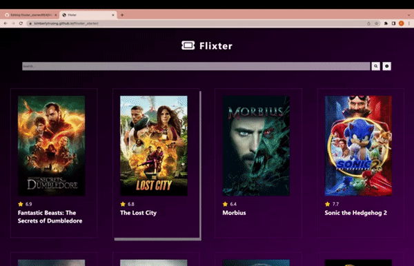

📝 `NOTE` Use this template to initialize the contents of a README.md file for your application. As you work on your assignment over the course of the week, update the required or stretch features lists to indicate which features you have completed by changing `[ ]` to `[x]`. (🚫 Remove this paragraph before submitting your assignment.)

## Week 1 Assignment: Flixster

Submitted by: Kimberly Truong

Estimated time spent: **14** hours spent in total

Deployed Application (optional): [Flixster Deployed Site](https://kimberlytruong.github.io/flixster_starter/)

### Application Features

#### CORE FEATURES

- [x] User can view a list of current movies from The Movie Database API as a grid view
  - The grid element should have an id of `movies-grid`
  - Each movie wrapper element should have a class of `movie-card`
- [x] For each movie displayed, user can see the following details:
  - Title - the element should have a class of `movie-title`
  - Image - the `img` element should have a class of `movie-poster`
  - Votes - the element should have a class of `movie-votes`
- [x] User can load more current movies by clicking a button at the bottom of the list
  - The button should have an id of `load-more-movies-btn`.
  - When clicked, the page should not refresh.
  - New movies should simply be added to the bottom
- [x] Allow users to search for movies and display them in a grid view
  - There should be a search input element with an id of `search-input`
  - Users should be able to type into the input
  - When a user hits 'Enter', it should send a search request to the movies API
  - The results from the search should be displayed on the page
  - There should be a close icon with an id of `close-search-btn` that exits the search, clears results, and shows the current movies displayed previously
- [x] Website accounts for basic HTML/CSS accessibility features
- [x] Website should be responsive

#### STRETCH FEATURES

- [x] Deploy website using GitHub Pages. 
- [x] Allow user to view more details about a movie within a popup.
- [x] Improve the user experience through CSS & animation.
- [x] Allow movie video trailers to be played using [embedded YouTube](https://support.google.com/youtube/answer/171780?hl=en)
- [x] Implement anything else that you can get done to improve the app functionality!

### Walkthrough Video

<!DOCTYPE html></html>

### Reflection

* Did the topics discussed in your labs prepare you to complete the assignment? Be specific, which features in your weekly assignment did you feel unprepared to complete?

Yes I felt prepared for the assignment.

* If you had more time, what would you have done differently? Would you have added additional features? Changed the way your project responded to a particular event, etc.
  
I think I had enough time. I was able to finish all the core functionality in a couple hours and actually spent most of my time on the css to improve the design. The only functionality I would add is information about where to watch the full movie and being able to filter by clicking on the genre tags.

* Reflect on your project demo, what went well? Were there things that maybe didn't go as planned? Did you notice something that your peer did that you would like to try next time?

My project demo went well. I'm still a bit confused about some of the errors I'm getting, but they have been significantly reduced from before and all the functionality of my website works. I'd like to look over those errors if I have time later on.
### Open-source libraries used

No open-source libraries were used.

### Shout out

Yilika was super helpful when I ran into tons of issues with formatting my website!

